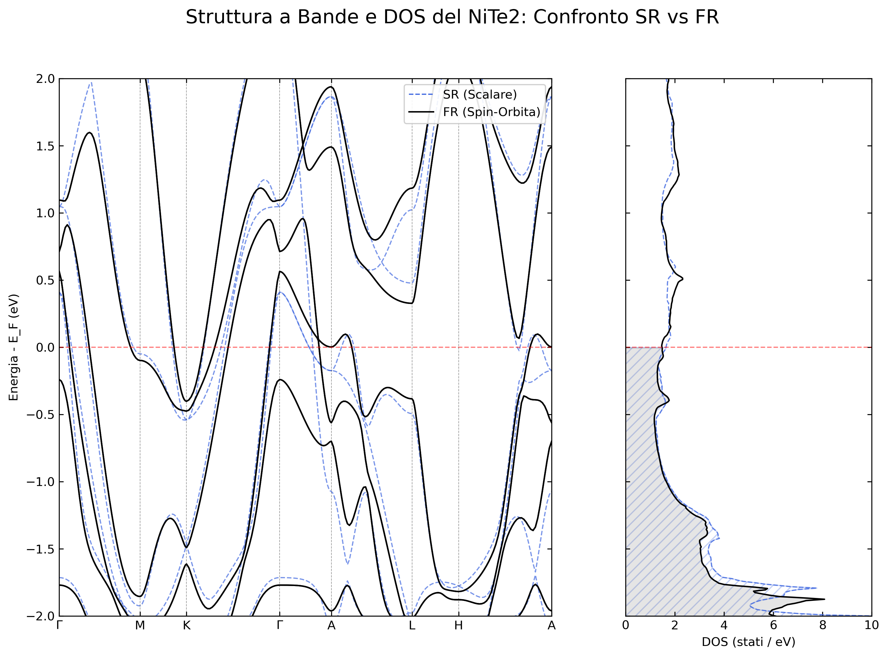
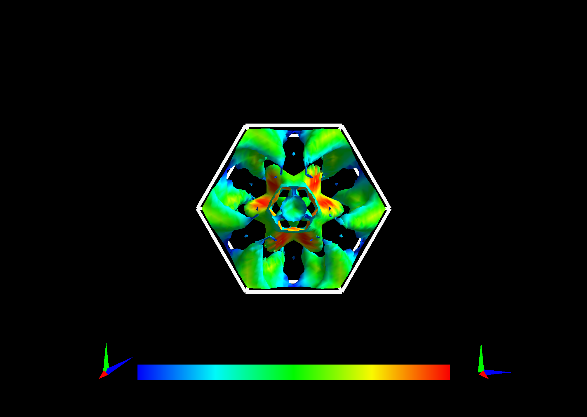
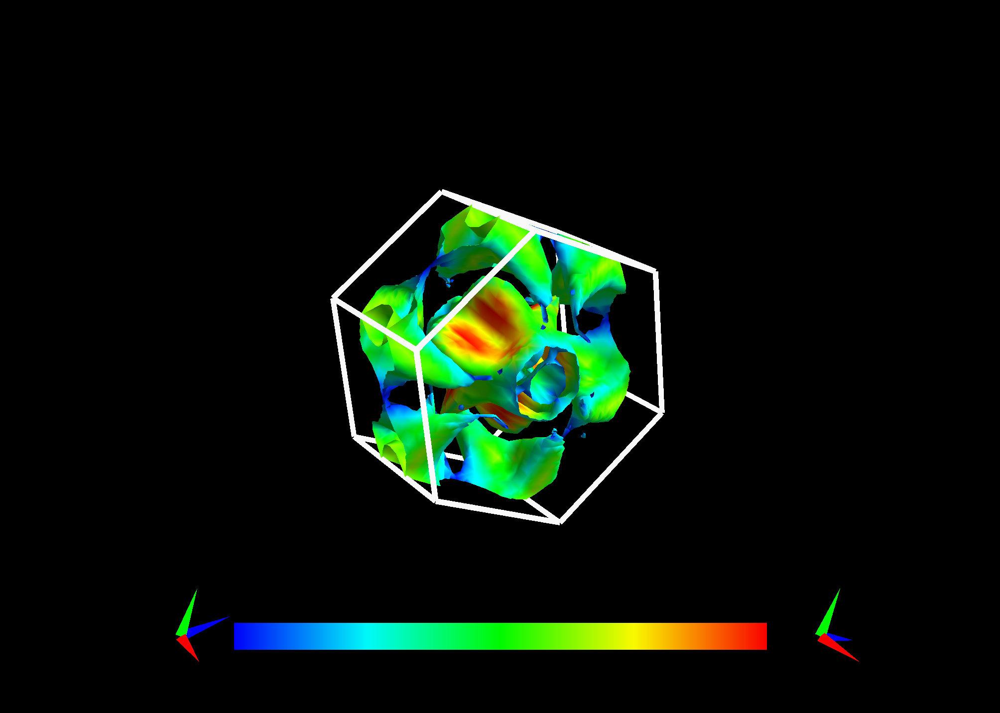
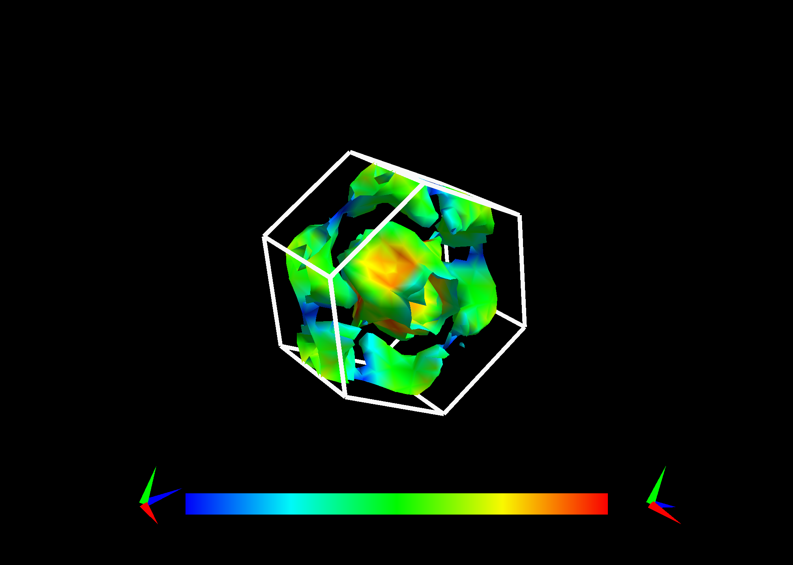

# Automated DFT Pipeline (Quantum ESPRESSO)

This repository provides an automated, modular pipeline for Density Functional Theory (DFT) calculations using Quantum ESPRESSO. It streamlines the entire workflow: from initial convergence testing and structural relaxation (`vc-relax`), to the extraction and visualization of electronic properties (Band structure, DOS, and Fermi Surface).

By decoupling the numerical infrastructure from the material's physical parameters via specific JSON configuration files, the pipeline ensures highly reproducible simulations in both Scalar Relativistic (SR) and Fully Relativistic (FR) regimes without requiring manual adjustments to the input scripts.

## Showcase: NiTe2 Electronic Structure

The pipeline natively supports advanced extraction and visualization of calculated electronic properties, handling both Scalar-Relativistic (SR) and Fully Relativistic (FR) regimes. Below is a showcase of the results generated using the provided `NiTe2` configuration.

### Band Structure and Density of States
The infrastructure automatically overlays SR and FR calculations to highlight Spin-Orbit Coupling (SOC) effects, such as band splitting and gap openings at the Dirac nodes.



### 3D Fermi Surface Topology
The pipeline formats NSCF calculations for direct interactive visualization via **FermiSurfer**. The extracted topology precisely reflects the physical differences between the selected regimes.

|                                     Scalar-Relativistic (SR)                                     |                                     Fully Relativistic (FR)                                      |
|:------------------------------------------------------------------------------------------------:|:------------------------------------------------------------------------------------------------:|
|    |    |
|  |  |

*To interactively inspect the generated surfaces on your local machine, check out the [NiTe2 Complete Example](examples/NiTe2_example/) directory for specific CLI commands.*

## Configuration Architecture

To ensure high reproducibility and ease of maintenance, the pipeline strictly separates the computational infrastructure from the physical properties of the system being studied. This is managed via two distinct JSON configuration files:

* **`config.json` (Computational Infrastructure):**
  Defines *how* the calculations are performed. It contains the numerical thresholds (e.g., `conv_thr`, `mixing_beta`), hardware-dependent settings (e.g., `outdir`, `pseudo_dir`), and step-specific parameter overrides (e.g., forcing `occupations = 'tetrahedra'` during NSCF calculations). This file ensures that all materials analyzed in a project follow the same numerical standards.

* **`<material>.json` (Physical Identity):**
  Defines *what* is being calculated. It contains the crystallographic and chemical data of the specific material (e.g., `NiTe2.json`). This includes the atomic positions, the high-symmetry k-path for band structures, convergence testing ranges (cutoff energy and k-points), and the mapping of both Scalar Relativistic (SR) and Fully Relativistic (FR) pseudopotentials.

## Prerequisites

To run this pipeline, the following external software must be installed on your system:
* **Quantum ESPRESSO:** The core DFT engine (`pw.x`, `dos.x`, `bands.x`, `fs.x`). The binaries should ideally be in your system's `PATH`. If they are not, you can specify their absolute path at runtime using the `--qe_path` flag.
* **FermiSurfer (Optional):** Required only if you intend to visualize the 3D Fermi surfaces (`fs.x` outputs).
* **Python 3.9+**

## Installation

1. **Clone the repository:**
   ```bash
   git clone https://github.com/gabrisur04-wq/Automated_DFT_Pipeline_QE.git
   cd Automated_DFT_Pipeline_QE
   ```

2. **Install Python dependencies:**
   It is recommended to use a virtual environment.
   ```bash
   pip install -r requirements.txt
   ```

3. **Prepare the Pseudopotentials:**
   Create a folder named `pseudo` in the root directory of the project and place the required `.upf` files for your materials inside it. The path `./pseudo/` is set as default in the `config.json`.
   ```bash
   mkdir pseudo
   # Copy your .upf files into the ./pseudo/ directory
   ```

## Examples

A ready-to-run demonstration for the Dirac semimetal NiTe2 is included in the repository. This allows you to test the complete pipeline out-of-the-box without initial manual configuration.

Please navigate to the `examples/NiTe2_example/` directory and read the local `README.md` for specific execution instructions.
   
## Quick Start / Usage

The pipeline is controlled via the `main.py` script, which uses a modular command-line interface. The workflow is divided into three sequential phases. 

**Parallelization Note:** The script uses `--num_cores` to specify the total MPI processes and `--npool` to distribute k-points. For standard multi-core desktop machines, it is highly recommended to use `--npool 1` to maximize memory efficiency and prevent MPI deadlocks during heavy NSCF calculations.

### 1. Setup and Structural Relaxation
This phase performs convergence tests (cutoff energy and k-points) and a variable-cell structural relaxation (`vc-relax`). It saves the optimized geometry to a state file (`<prefix>_state.json`).

```bash
python main.py --prefix NiTe2 setup --num_cores 4 --npool 1
```

### 2. Execution (Run)
Once the setup is complete, you can run the main computational pipeline. You must specify the physical mode: `SR` (Scalar Relativistic) or `FR` (Fully Relativistic).

```bash
# Run the full pipeline in Scalar Relativistic mode
python main.py --prefix NiTe2 run --mode SR --num_cores 4 --npool 1

# Run the full pipeline in Fully Relativistic mode
python main.py --prefix NiTe2 run --mode FR --num_cores 4 --npool 1
```

*Advanced usage:* You can execute specific steps of the pipeline (`scf`, `dos`, `fs`, `bands`) independently using the `--step` flag. Note that temporary directories (`tmp*`) should be cleared before starting a new full calculation.
```bash
python main.py --prefix NiTe2 run --mode SR --step scf --num_cores 4 --npool 1
```

### 3. Post-Processing and Plotting
After the calculations are finished, use the `plot` command to extract data and generate visualizations.

```bash
# Plot the SR and the FR results respectively
python ../../main.py --prefix NiTe2 plot --mode SR
python ../../main.py --prefix NiTe2 plot --mode FR

# Overlay SR and FR results for comparison
python ../../main.py --prefix NiTe2 plot --mode compare

# Visualize the Scalar-Relativistic and the Fully-Relativistic Fermi Surface respectively (requires FermiSurfer)
python ../../main.py --prefix NiTe2 plot --mode fs_sr
python ../../main.py --prefix NiTe2 plot --mode fs_fr
```
*Note: Plotting axes limits can be adjusted using the optional flags `--emin`, `--emax`, and `--dos_max`.*

---

*Tip: You can access the built-in command-line help at any time by running `python main.py --help` or `python main.py <command> --help` (e.g., `python main.py run --help`).*

## Output Structure

The pipeline automatically creates and manages the following working directories:
* `inputs/`: Generated Quantum ESPRESSO `.in` files.
* `outputs/`: Log files (`.out`), extracted data arrays (`.dos`, `.dat.gnu`, `.bxsf`) and final generated plots (`*.png`).
* `tmp*/`: Temporary directories containing wavefunctions and isolated `.save` folders for specific calculation branches.
* `reference_outputs/`: Directories (located inside example folders) containing pre-computed results and original demonstration plots, provided for direct benchmark comparison.